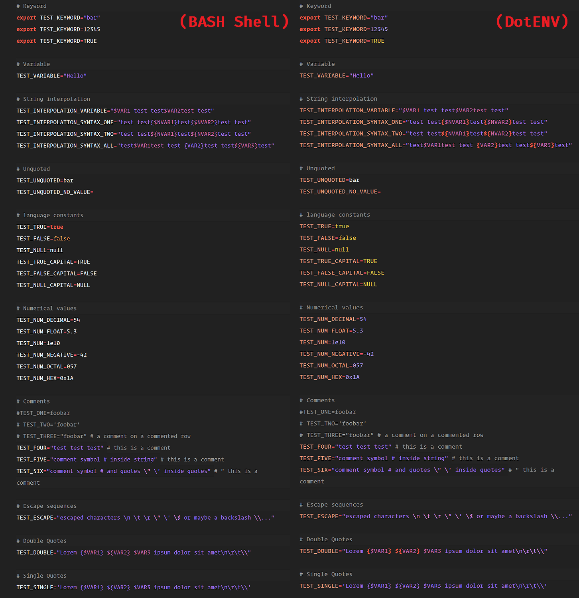

# DotENV
SublimeText Syntax Highlighting support for Environment (.env) Files

### Links
*[PackageControl.io](https://packagecontrol.io/packages/DotENV)*

### Installation:

#### Package Control:

1. Make sure you already have Package Control installed.
2. Choose Install Package from the Command Palette (`Ctrl+Shift+P` on Windows/Linux Or `⇧⌘P` on OS X)
3. Select `DotENV` and hit **`Enter`**

#### Manually:

1. Clone the repo to your Packages folder.
2. Activate by `Ctrl+Shift+P` and fuzzy search `syntax dotenv` and hit **`Enter`**

#### Preview:

